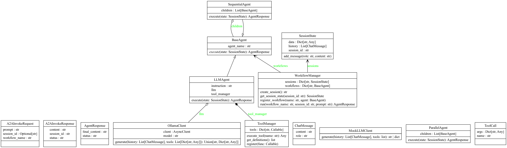
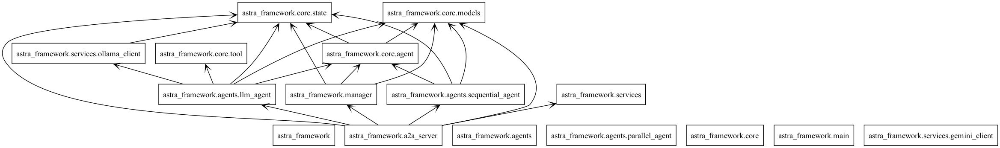

# Architecture

## Class Diagram

## Package Diagram

## Sequence Diagram

## Design Patterns

### Behavioral Patterns
These are the most important patterns in the ADK, as they define how agents communicate, collaborate, and execute.

#### Strategy Pattern
This is the core pattern for the ADK's entire workflow system. The ADK provides different "workflow agents" that are concrete implementations of an execution strategy. The orchestrator uses the strategy you select.

*Example:* You choose `SequentialAgent` for a step-by-step strategy, `ParallelAgent` for a fan-out/gather strategy, or the default `LlmAgent` for an LLM-driven, dynamic strategy. You are swapping out the algorithm (the strategy) that controls the agentic workflow.

#### Observer Pattern (via Callbacks)
The ADK is built for extensibility using an explicit "Callback" system, which is a direct implementation of the Observer pattern.

*Example:* You can "subscribe" your own functions to events in the agent's lifecycle, such as `before_model_callback`, `after_tool_callback`, or `before_agent_callback`. Your function is "notified" when the event happens, allowing you to log data, enforce guardrails, or even modify the request/response.

#### Mediator Pattern
The "Coordinator" or "Root Agent" in a multi-agent system acts as a Mediator. It manages all the complex interactions and delegations between specialized sub-agents.

*Example:* Your `TripPlanner` root agent receives a request. It mediates by first calling the `FlightAgent`, then the `HotelAgent`. The `FlightAgent` and `HotelAgent` don't know about each other; they only report back to the central Mediator (the root agent).

#### Chain of Responsibility Pattern
This is directly implemented by the `SequentialAgent`.

*Example:* When you use a `SequentialAgent`, the output of the first sub-agent is automatically passed as the input to the second sub-agent, and so on. This forms a "chain" where each agent processes the request in a predefined order.

#### Command Pattern
At a lower level, an agent's decision to use a tool is an example of the Command pattern.

*Example:* The LLM's output (e.g., `{"tool_call": "search", "query": "latest news"}`) is a "command" object. It encapsulates a request (the action to perform and its parameters) which is then passed to the ADK's "invoker" (the tool dispatcher) to be executed.

### Structural Patterns
These patterns are used to organize the agents and their components.

#### Composite Pattern
This pattern is fundamental to how ADK builds multi-agent hierarchies. It allows you to treat a single agent (a leaf) and a group of agents (a composite) in the same way.

*Example:* A parent `LlmAgent` has a list of `sub_agents`. From the outside, you just `run()` the parent agent. The Composite pattern allows the parent to manage its children, running them as needed, while exposing the same simple interface.

#### Facade Pattern
The "Root Agent" in any ADK application acts as a Facade.

*Example:* A user interacts with a single `ChatAgent`. Internally, this agent may be a complex system that uses a `ToolAgent`, a `ResearchAgent`, and a `DatabaseAgent`. The `ChatAgent` provides a simple, unified interface (the facade) that hides this internal complexity from the user.

### Creational Patterns
These patterns are used to create the agents themselves.

#### Factory Method (Implied)
The ADK framework uses factory-like methods to construct and initialize different types of agents.

*Example:* When you define an agent, you provide its configuration (model, tools, instructions). The ADK framework takes this configuration and uses an internal factory to instantiate the correct agent object with all its dependencies, without you needing to manually wire everything together.

### Blackboard Pattern
For session-based state management, particularly in a multi-agent or complex workflow context like the ADK, the best and most common architectural pattern is the Blackboard Pattern. This pattern is often implemented by passing around a Context Object.

#### The Blackboard Pattern
Think of a Blackboard as a central, shared "whiteboard" for your entire session. Any agent or component involved in the session can walk up to the board, write a new piece of information (e.g., `user_id = '123'`), read existing information (e.g., `customer_id`), or erase old information.

This pattern is ideal for session state because:
- **It Decouples Components:** Your `FlightAgent` doesn't need to know that your `HotelAgent` exists. The `FlightAgent` simply writes the `booking_confirmation` to the blackboard, and the `HotelAgent` can read it from there later.
- **It's a Centralized Hub:** All session-specific data lives in one place. This makes it incredibly easy to debug (you can just "look at the blackboard" at any step) or to save the entire session's state (you just save the blackboard's contents).
- **It's Flexible:** You can add new agents that read/write from the blackboard without ever having to change the interfaces of the existing agents.

#### The Implementation: The "Context Object"
While the Blackboard is the architectural pattern, the most common implementation pattern to make it work is by using a Context Object.
