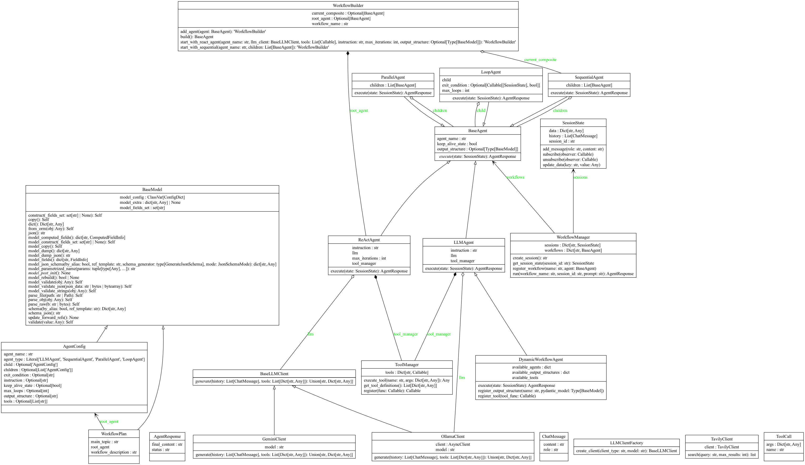
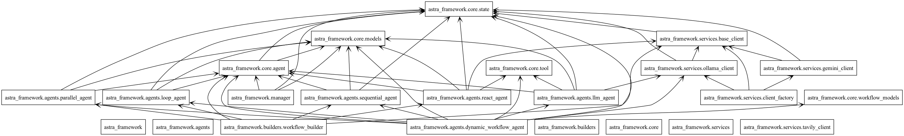

# Architecture

## Class Diagram

## Package Diagram

## Sequence Diagram

## Design Patterns

---

### Blackboard Pattern

**Description:** The Blackboard pattern is a behavioral design pattern that 
provides a central, shared repository of information (the blackboard) that 
various components can read from and write to. It allows for indirect 
communication and coordination between components.

**Wikipedia:** [Blackboard system](https://en.wikipedia.org/wiki/Blackboard_system)

**Participating Classes:**
- `astra_framework.core.state.SessionState` (Blackboard)
- `astra_framework.core.agent.BaseAgent` (Knowledge Source)

**How it's used in Astra:** `SessionState` acts as the central blackboard 
for a given workflow execution. It holds the shared `history` of messages 
and a `data` dictionary for arbitrary data. Each agent in a workflow can 
read the current state of the conversation from the `SessionState` and 
write its own contributions back (e.g., adding a new message or a tool 
result).

---

### Builder Pattern

**Description:** The Builder pattern is a creational design pattern that 
allows for the step-by-step construction of complex objects. It separates 
the construction of a complex object from its representation, allowing the 
same construction process to create different representations.

**Wikipedia:** [Builder pattern](https://en.wikipedia.org/wiki/Builder_pattern)

**Participating Classes:**
- `astra_framework.builders.workflow_builder.WorkflowBuilder` (Builder)
- `astra_framework.manager.WorkflowManager` (Director - implicitly uses 
  the builder)
- `astra_framework.core.agent.BaseAgent` (Product Interface)

**How it's used in Astra:** The `WorkflowBuilder` provides a fluent and 
declarative API for constructing complex agent workflows. Instead of 
manually instantiating and nesting various `BaseAgent` subclasses (like 
`SequentialAgent`, `ParallelAgent`, `ReActAgent`), developers can use the 
builder to define the structure of their workflow step-by-step. This 
significantly improves the readability and maintainability of workflow 
definitions, especially for intricate multi-agent systems. The 
`WorkflowManager` can then register and run the `BaseAgent` product 
created by the builder.

---

### Chain of Responsibility Pattern

**Description:** The Chain of Responsibility pattern is a behavioral design 
pattern that lets you pass requests along a chain of handlers. Upon 
receiving a request, each handler decides either to process the request or 
to pass it to the next handler in the chain.

**Wikipedia:** [Chain-of-responsibility pattern](https://en.wikipedia.org/wiki/Chain-of-responsibility_pattern)

**Participating Classes:**
- `astra_framework.agents.sequential_agent.SequentialAgent` (Chain)
- `astra_framework.core.agent.BaseAgent` (Handler)

**How it's used in Astra:** The `SequentialAgent` directly implements this 
pattern. It holds a list of child agents (the chain) and executes them in 
a predefined order. With the `output_structure` feature, the output of 
one agent is processed and can become the sole input for the next, forming 
a clear chain where each agent processes the request in sequence.

---

### Command Pattern

**Description:** The Command pattern is a behavioral design pattern that 
turns a request into a stand-alone object that contains all information 
about the request.

**Wikipedia:** [Command pattern](https://en.wikipedia.org/wiki/Command_pattern)

**Participating Classes:**
- `astra_framework.agents.llm_agent.LLMAgent` (Client/Creator)
- `astra_framework.core.tool.ToolManager` (Invoker)

**How it's used in Astra:** An agent's decision to use a tool is a prime 
example of the Command pattern. The LLM generates a `tool_call` dictionary 
(the Command object), which encapsulates the request (the function name 
and its arguments). This command is then passed to the `ToolManager` (the 
Invoker), which is responsible for executing the actual function (the 
Receiver).

---

### Composite Pattern

**Description:** The Composite pattern is a structural design pattern that 
allows you to compose objects into tree structures and then work with 
these structures as if they were individual objects.

**Wikipedia:** [Composite pattern](https://en.wikipedia.org/wiki/Composite_pattern)

**Participating Classes:**
- `astra_framework.core.agent.BaseAgent` (Component)
- `astra_framework.agents.llm_agent.LLMAgent` (Leaf)
- `astra_framework.agents.sequential_agent.SequentialAgent` (Composite)

**How it's used in Astra:** This pattern is fundamental to how workflows 
are built. `BaseAgent` is the common interface. `LLMAgent` is a "leaf" 
node that performs a specific task. `SequentialAgent` is a "composite" 
node that holds a list of child `BaseAgent` objects. Because they share 
the same interface, the `WorkflowManager` can execute a `SequentialAgent` 
just like it would a single `LLMAgent`, allowing for the construction of 
complex, nested workflows.

---

### Data Transfer Object (DTO) Pattern

**Description:** The Data Transfer Object pattern is a design pattern used 
to transfer data between software application subsystems. DTOs are simple 
objects that should not contain any business logic but rather be focused 
on serializing and deserializing data.

**Wikipedia:** [Data transfer object](https://en.wikipedia.org/wiki/Data_transfer_object)

**Participating Classes:**
- `pydantic.BaseModel` (Base DTO)
- `run_workflow.CalculationResult` (Concrete DTO)
- `astra_framework.agents.llm_agent.LLMAgent` (Creator/Consumer)
- `astra_framework.agents.sequential_agent.SequentialAgent` (Transferer)

**How it's used in Astra:** This pattern is enabled by the 
`output_structure` feature. An `LLMAgent` can be configured with a 
Pydantic model as its `output_structure`. This forces the agent to return 
a well-defined DTO (`CalculationResult` in the example). The 
`SequentialAgent` then transfers this DTO to the next agent in the chain, 
which can then consume it. This creates a strong, explicit contract 
between agents, making the workflow more reliable and easier to debug than 
passing around unstructured text or a complex state object.

---

### Facade Pattern

**Description:** The Facade pattern is a structural design pattern that 
provides a simplified, higher-level interface to a complex subsystem of 
components.

**Wikipedia:** [Facade pattern](https://en.wikipedia.org/wiki/Facade_pattern)

**Participating Classes:**
- `astra_framework.manager.WorkflowManager` (Facade)

**How it's used in Astra:** The `WorkflowManager` acts as a facade for the 
entire framework. It hides the underlying complexity of session creation, 
state management, and agent execution. A user can simply call 
`manager.run()` with a workflow name and a prompt, without needing to 
manually instantiate agents, manage state objects, or orchestrate the 
execution flow.

---

### Factory Method Pattern (Implied)

**Description:** The Factory Method pattern is a creational design pattern 
that provides an interface for creating objects in a superclass, but 
allows subclasses to alter the type of objects that will be created.

**Wikipedia:** [Factory method pattern](https://en.wikipedia.org/wiki/Factory_method_pattern)

**Participating Classes:**
- `astra_framework.manager.WorkflowManager` (Factory)

**How it's used in Astra:** This pattern is used implicitly in the 
`WorkflowManager`. The `register_workflow` method acts as a factory. The 
user provides the components (an agent object and a name), and the 
manager is responsible for storing and providing the "product" (the 
executable workflow) when requested via the `run` method. It decouples 
the client that requests a workflow from the actual implementation of that 
workflow.

---

### Observer Pattern

**Description:** The Observer pattern is a behavioral design pattern in which 
an object, called the subject, maintains a list of its dependents, called 
observers, and notifies them automatically of any state changes, usually by 
calling one of their methods.

**Wikipedia:** [Observer pattern](https://en.wikipedia.org/wiki/Observer_pattern)

**Participating Classes:**
- `astra_framework.core.state.SessionState` (Observable Subject)
- `astra_framework.core.state.SessionState._observers` (List of Observers)
- `astra_framework.core.state.SessionState.subscribe()` (Attach Observer)
- `astra_framework.core.state.SessionState.unsubscribe()` (Detach Observer)
- `astra_framework.core.state.SessionState._notify()` (Notify Observers)
- `astra_framework.agents.react_agent.ReActAgent` (Potential Observer)

**How it's used in Astra:** The `SessionState` implements the Observable 
part of this pattern. It allows components (observers) to subscribe to its 
changes. When the `SessionState` is updated (e.g., a new message is added), 
it notifies its subscribed observers. This enables reactive programming 
paradigms where components can automatically react to relevant updates 
without constant polling. For instance, the `ReActAgent` can be notified 
of state changes to continue its Thought-Action-Observation loop.

---

### ReAct Pattern

**Description:** The ReAct (Reasoning + Acting) pattern is a prominent 
design pattern in LLM-based agents that combines reasoning (generating 
thoughts/plans) and acting (executing tools) in an interleaved manner. An 
agent following ReAct continuously reasons about the current situation, 
decides on an action, executes it, observes the result, and then reasons 
again with the updated information, forming an iterative loop until a 
final answer is reached.

**Relevant Paper:** [ReAct: Synergizing Reasoning and Acting in Language Models](https://arxiv.org/abs/2210.03629)

**Participating Classes:**
- `astra_framework.agents.react_agent.ReActAgent` (The ReAct Agent)
- `astra_framework.core.state.SessionState` (Observation/Context - now 
  Observable)
- `astra_framework.core.tool.ToolManager` (Tool Execution)

**How it's used in Astra:** The `ReActAgent` is the primary implementation 
of the ReAct pattern within Astra.
1.  **Reasoning (Thought):** The `ReActAgent` constructs a prompt for the 
    underlying LLM, including the current `SessionState` history and 
    available `tool_definitions`. The LLM then "reasons" to decide the 
    next step, often explicitly outputting its thought process.
2.  **Acting (Action):** Based on its reasoning, the LLM might decide to 
    call one or more tools. These tool calls are parsed by the 
    `ReActAgent`.
3.  **Execution:** The `ToolManager` executes the chosen tool(s), and the 
    results are obtained.
4.  **Observation:** The results of the tool execution are added back to 
    the `SessionState` history as new observations. The `SessionState` 
    (now an Observable Subject) notifies the `ReActAgent` (as an Observer) 
    of this change.
5.  **Loop:** The `ReActAgent` then re-invokes the LLM with the updated 
    `SessionState`, allowing the LLM to reason again with the new 
    observations. This continuous cycle of reasoning, acting, and 
    observing enables the `ReActAgent` to perform complex tasks by 
    breaking them down into smaller, manageable steps.

---

### Strategy Pattern

**Description:** The Strategy pattern is a behavioral design pattern that 
enables selecting an algorithm at runtime. It defines a family of 
algorithms, encapsulates each one, and makes them interchangeable.

**Wikipedia:** [Strategy pattern](https://en.wikipedia.org/wiki/Strategy_pattern)

**Participating Classes:**
- `astra_framework.core.agent.BaseAgent` (Strategy Interface)
- `astra_framework.agents.llm_agent.LLMAgent` (Concrete Strategy)
- `astra_framework.agents.sequential_agent.SequentialAgent` (Concrete Strategy)
- `astra_framework.manager.WorkflowManager` (Context)

**How it's used in Astra:** This is the core pattern for the entire workflow 
system. The `WorkflowManager` is the context that runs a workflow. Each 
workflow is a "strategy" for achieving a goal. Users can define different 
agentic strategies (a single `LLMAgent`, a `SequentialAgent` containing 
multiple children, etc.) and register them with the manager. The manager 
then executes the chosen strategy without needing to know the specific 
implementation details of the agent(s) involved.

